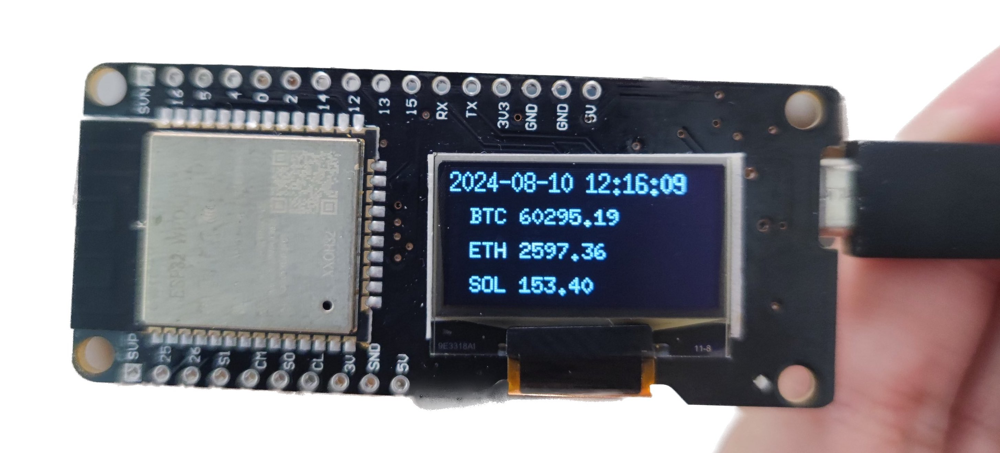

# Esp32-oled-0.96-inch on Rust demo

* display on oled
* Wifi connect
* Https client
* Crypto Price display (BTC/ETH/SOL)




# build and flash and monitor

## display on oled
cargo build --release && espflash flash -p /dev/ttyUSB0 target/xtensa-esp32-espidf/release/rust-esp32-oled-0-96-inch --monitor

```text
[2024-08-09T15:40:59Z INFO ] Serial port: '/dev/ttyUSB0'
[2024-08-09T15:40:59Z INFO ] Connecting...
[2024-08-09T15:41:00Z INFO ] Using flash stub
Chip type:         esp32 (revision v3.1)
Crystal frequency: 40 MHz
Flash size:        4MB
Features:          WiFi, BT, Dual Core, 240MHz, Coding Scheme None
MAC address:       08:a6:f7:22:99:d4
App/part. size:    397,696/4,128,768 bytes, 9.63%
[2024-08-09T15:41:01Z INFO ] Segment at address '0x1000' has not changed, skipping write
[2024-08-09T15:41:01Z INFO ] Segment at address '0x8000' has not changed, skipping write
[00:00:23] [========================================]     230/230     0x10000                                                                                                                                                                                                                                      [2024-08-09T15:41:26Z INFO ] Flashing has completed!
Commands:
    CTRL+R    Reset chip
    CTRL+C    Exit

ets Jul 29 2019 12:21:46

rst:0x1 (POWERON_RESET),boot:0x17 (SPI_FAST_FLASH_BOOT)
configsip: 0, SPIWP:0xee
clk_drv:0x00,q_drv:0x00,d_drv:0x00,cs0_drv:0x00,hd_drv:0x00,wp_drv:0x00
mode:DIO, clock div:2
load:0x3fff0030,len:7104
load:0x40078000,len:15576
load:0x40080400,len:4
0x40080400 - _invalid_pc_placeholder
    at ??:??
ho 8 tail 4 room 4
load:0x40080404,len:3876
entry 0x4008064c
I (31) boot: ESP-IDF v5.1-beta1-378-gea5e0ff298-dirt 2nd stage bootloader
I (31) boot: compile time Jun  7 2023 07:48:23
I (33) boot: Multicore bootloader
I (37) boot: chip revision: v3.1
I (41) boot.esp32: SPI Speed      : 40MHz
I (46) boot.esp32: SPI Mode       : DIO
I (50) boot.esp32: SPI Flash Size : 4MB
I (55) boot: Enabling RNG early entropy source...
I (60) boot: Partition Table:
I (64) boot: ## Label            Usage          Type ST Offset   Length
I (71) boot:  0 nvs              WiFi data        01 02 00009000 00006000
I (79) boot:  1 phy_init         RF data          01 01 0000f000 00001000
I (86) boot:  2 factory          factory app      00 00 00010000 003f0000
I (94) boot: End of partition table
I (98) esp_image: segment 0: paddr=00010020 vaddr=3f400020 size=12720h ( 75552) map
I (134) esp_image: segment 1: paddr=00022748 vaddr=3ffb0000 size=0229ch (  8860) load
I (137) esp_image: segment 2: paddr=000249ec vaddr=40080000 size=0b62ch ( 46636) load
I (159) esp_image: segment 3: paddr=00030020 vaddr=400d0020 size=3ff10h (261904) map
I (254) esp_image: segment 4: paddr=0006ff38 vaddr=4008b62c size=01218h (  4632) load
I (262) boot: Loaded app from partition at offset 0x10000
I (262) boot: Disabling RNG early entropy source...
I (276) cpu_start: Multicore app
I (285) cpu_start: Pro cpu start user code
I (285) cpu_start: cpu freq: 160000000 Hz
I (285) app_init: Application information:
I (288) app_init: Project name:     libespidf
I (293) app_init: App version:      9e90370-dirty
I (298) app_init: Compile time:     Aug  9 2024 23:02:29
I (304) app_init: ELF file SHA256:  000000000...
I (309) app_init: ESP-IDF:          v5.4-dev-1388-g5ca9f2a49a
I (316) efuse_init: Min chip rev:     v0.0
I (321) efuse_init: Max chip rev:     v3.99 
I (326) efuse_init: Chip rev:         v3.1
I (331) heap_init: Initializing. RAM available for dynamic allocation:
I (338) heap_init: At 3FFAE6E0 len 00001920 (6 KiB): DRAM
I (344) heap_init: At 3FFB2BF0 len 0002D410 (181 KiB): DRAM
I (350) heap_init: At 3FFE0440 len 00003AE0 (14 KiB): D/IRAM
I (356) heap_init: At 3FFE4350 len 0001BCB0 (111 KiB): D/IRAM
I (363) heap_init: At 4008C844 len 000137BC (77 KiB): IRAM
I (370) spi_flash: detected chip: generic
I (373) spi_flash: flash io: dio
W (378) pcnt(legacy): legacy driver is deprecated, please migrate to `driver/pulse_cnt.h`
W (386) i2c: This driver is an old driver, please migrate your application code to adapt `driver/i2c_master.h`
W (397) timer_group: legacy driver is deprecated, please migrate to `driver/gptimer.h`
I (406) main_task: Started on CPU0
I (416) main_task: Calling app_main()
I (416) rust_esp32_oled_0_96_inch: Hello, world!

```

## wifi
export WIFI_SSID=your_wifi_ssid
export WIFI_PASS=your_wifi_password

cargo build --release &&espflash flash -p /dev/ttyUSB0 target/xtensa-esp32-espidf/release/wifi --monitor

```text
[2024-08-10T02:45:29Z INFO ] Serial port: '/dev/ttyUSB0'
[2024-08-10T02:45:29Z INFO ] Connecting...
[2024-08-10T02:45:30Z INFO ] Using flash stub
Chip type:         esp32 (revision v3.1)
Crystal frequency: 40 MHz
Flash size:        4MB
Features:          WiFi, BT, Dual Core, 240MHz, Coding Scheme None
MAC address:       08:a6:f7:22:99:d4
App/part. size:    950,144/4,128,768 bytes, 23.01%
[2024-08-10T02:45:32Z INFO ] Segment at address '0x1000' has not changed, skipping write
[2024-08-10T02:45:32Z INFO ] Segment at address '0x8000' has not changed, skipping write
[00:01:01] [========================================]     605/605     0x10000                                                                                                                                                                                                                                   [2024-08-10T02:46:34Z INFO ] Flashing has completed!
Commands:
    CTRL+R    Reset chip
    CTRL+C    Exit

ets Jul 29 2019 12:21:46

rst:0x1 (POWERON_RESET),boot:0x17 (SPI_FAST_FLASH_BOOT)
configsip: 0, SPIWP:0xee
clk_drv:0x00,q_drv:0x00,d_drv:0x00,cs0_drv:0x00,hd_drv:0x00,wp_drv:0x00
mode:DIO, clock div:2
load:0x3fff0030,len:7104
load:0x40078000,len:15576
load:0x40080400,len:4
0x40080400 - _invalid_pc_placeholder
    at ??:??
ho 8 tail 4 room 4
load:0x40080404,len:3876
entry 0x4008064c
I (31) boot: ESP-IDF v5.1-beta1-378-gea5e0ff298-dirt 2nd stage bootloader
I (31) boot: compile time Jun  7 2023 07:48:23
I (33) boot: Multicore bootloader
I (37) boot: chip revision: v3.1
I (41) boot.esp32: SPI Speed      : 40MHz
I (46) boot.esp32: SPI Mode       : DIO
I (50) boot.esp32: SPI Flash Size : 4MB
I (55) boot: Enabling RNG early entropy source...
I (60) boot: Partition Table:
I (64) boot: ## Label            Usage          Type ST Offset   Length
I (71) boot:  0 nvs              WiFi data        01 02 00009000 00006000
I (79) boot:  1 phy_init         RF data          01 01 0000f000 00001000
I (86) boot:  2 factory          factory app      00 00 00010000 003f0000
I (94) boot: End of partition table
I (98) esp_image: segment 0: paddr=00010020 vaddr=3f400020 size=26cf4h (158964) map
I (164) esp_image: segment 1: paddr=00036d1c vaddr=3ffb0000 size=03d48h ( 15688) load
I (170) esp_image: segment 2: paddr=0003aa6c vaddr=40080000 size=055ach ( 21932) load
I (180) esp_image: segment 3: paddr=00040020 vaddr=400d0020 size=a7db0h (687536) map
I (428) esp_image: segment 4: paddr=000e7dd8 vaddr=400855ac size=10184h ( 65924) load
I (467) boot: Loaded app from partition at offset 0x10000
I (467) boot: Disabling RNG early entropy source...
I (479) cpu_start: Multicore app
I (487) cpu_start: Pro cpu start user code
I (487) cpu_start: cpu freq: 160000000 Hz
I (487) app_init: Application information:
I (490) app_init: Project name:     libespidf
I (495) app_init: App version:      9e90370-dirty
I (500) app_init: Compile time:     Aug  9 2024 23:02:29
I (506) app_init: ELF file SHA256:  000000000...
I (512) app_init: ESP-IDF:          v5.4-dev-1388-g5ca9f2a49a
I (518) efuse_init: Min chip rev:     v0.0
I (523) efuse_init: Max chip rev:     v3.99 
I (528) efuse_init: Chip rev:         v3.1
I (533) heap_init: Initializing. RAM available for dynamic allocation:
I (540) heap_init: At 3FFAE6E0 len 00001920 (6 KiB): DRAM
I (546) heap_init: At 3FFB8000 len 00028000 (160 KiB): DRAM
I (552) heap_init: At 3FFE0440 len 00003AE0 (14 KiB): D/IRAM
I (558) heap_init: At 3FFE4350 len 0001BCB0 (111 KiB): D/IRAM
I (565) heap_init: At 40095730 len 0000A8D0 (42 KiB): IRAM
I (573) spi_flash: detected chip: generic
I (576) spi_flash: flash io: dio
W (580) pcnt(legacy): legacy driver is deprecated, please migrate to `driver/pulse_cnt.h`
W (588) timer_group: legacy driver is deprecated, please migrate to `driver/gptimer.h`
I (598) main_task: Started on CPU0
I (608) main_task: Calling app_main()
I (608) wifi: Hello, world!
I (638) wifi:wifi driver task: 3ffbfddc, prio:23, stack:6656, core=0
I (638) wifi:wifi firmware version: c66883a92
I (638) wifi:wifi certification version: v7.0
I (638) wifi:config NVS flash: enabled
I (638) wifi:config nano formating: disabled
I (648) wifi:Init data frame dynamic rx buffer num: 32
I (648) wifi:Init static rx mgmt buffer num: 10
I (658) wifi:Init management short buffer num: 32
I (658) wifi:Init dynamic tx buffer num: 32
I (658) wifi:Init static rx buffer size: 1600
I (668) wifi:Init static rx buffer num: 10
I (668) wifi:Init dynamic rx buffer num: 32
I (678) wifi_init: rx ba win: 6
I (678) wifi_init: accept mbox: 6
I (678) wifi_init: tcpip mbox: 32
I (688) wifi_init: udp mbox: 6
I (688) wifi_init: tcp mbox: 6
I (688) wifi_init: tcp tx win: 5760
I (698) wifi_init: tcp rx win: 5760
I (698) wifi_init: tcp mss: 1440
I (708) wifi_init: WiFi IRAM OP enabled
I (708) wifi_init: WiFi RX IRAM OP enabled
I (718) wifi: 配置WiFi
I (738) wifi: 启动WiFi
I (738) phy_init: phy_version 4830,54550f7,Jun 20 2024,14:22:08
W (738) phy_init: failed to load RF calibration data (0x1102), falling back to full calibration
W (818) phy_init: saving new calibration data because of checksum failure, mode(2)
I (838) wifi:mode : sta (08:a6:f7:22:99:d4)
I (838) wifi:enable tsf
I (838) wifi: 连接WiFi
I (3508) wifi:new:<5,0>, old:<1,0>, ap:<255,255>, sta:<5,0>, prof:1, snd_ch_cfg:0x0
I (3508) wifi:state: init -> auth (0xb0)
I (3528) wifi:state: auth -> assoc (0x0)
I (3578) wifi:state: assoc -> run (0x10)
I (3598) wifi:connected with HIWIFI, aid = 17, channel 5, BW20, bssid = 64:64:4a:9a:2b:c5
I (3598) wifi:security: WPA2-PSK, phy: bgn, rssi: -35
I (3608) wifi:pm start, type: 1

I (3608) wifi:dp: 1, bi: 102400, li: 3, scale listen interval from 307200 us to 307200 us
I (3618) wifi: 等待底层网络接口启动
I (3688) wifi:AP's beacon interval = 102400 us, DTIM period = 1
I (4158) wifi:<ba-add>idx:0 (ifx:0, 64:64:4a:9a:2b:c5), tid:6, ssn:2, winSize:64
I (5118) esp_netif_handlers: sta ip: 192.168.31.165, mask: 255.255.255.0, gw: 192.168.31.1
I (5118) wifi: 获取到IP地址为:Ok(IpInfo { ip: 192.168.31.165, subnet: Subnet { gateway: 192.168.31.1, mask: Mask(24) }, dns: Some(192.168.31.1), secondary_dns: Some(0.0.0.0) })
I (5128) wifi:state: run -> init (0x0)
I (5138) wifi:pm stop, total sleep time: 1047021 us / 1522488 us

I (5138) wifi:<ba-del>idx:0, tid:6
I (5148) wifi:new:<5,0>, old:<5,0>, ap:<255,255>, sta:<5,0>, prof:1, snd_ch_cfg:0x0
E (5148) wifi:NAN WiFi stop
I (5188) wifi:flush txq
I (5188) wifi:stop sw txq
I (5188) wifi:lmac stop hw txq
I (5188) esp_idf_svc::wifi: EspWifi dropped
I (5188) esp_idf_svc::netif: Dropped
I (5188) esp_idf_svc::netif: Dropped
I (5198) wifi:Deinit lldesc rx mblock:10
I (5208) esp_idf_svc::nvs: NvsDefault dropped
I (5208) esp_idf_svc::eventloop: System event loop dropped
I (5208) main_task: Returned from app_main()

```

## wifi
export WIFI_SSID=your_wifi_ssid
export WIFI_PASS=your_wifi_password

cargo build --release &&espflash flash -p /dev/ttyUSB0 target/xtensa-esp32-espidf/release/crypto_price_display --monitor
```text
[2024-08-10T04:13:16Z INFO ] Serial port: '/dev/ttyUSB0'
[2024-08-10T04:13:16Z INFO ] Connecting...
[2024-08-10T04:13:16Z INFO ] Using flash stub
Chip type:         esp32 (revision v3.1)
Crystal frequency: 40 MHz
Flash size:        4MB
Features:          WiFi, BT, Dual Core, 240MHz, Coding Scheme None
MAC address:       08:a6:f7:22:99:d4
App/part. size:    1,289,232/4,128,768 bytes, 31.23%
[2024-08-10T04:13:18Z INFO ] Segment at address '0x1000' has not changed, skipping write
[2024-08-10T04:13:18Z INFO ] Segment at address '0x8000' has not changed, skipping write
[00:01:26] [========================================]     834/834     0x10000                                                                                                                                                                                                                                   [2024-08-10T04:14:46Z INFO ] Flashing has completed!
Commands:
    CTRL+R    Reset chip
    CTRL+C    Exit

ets Jul 29 2019 12:21:46

rst:0x1 (POWERON_RESET),boot:0x17 (SPI_FAST_FLASH_BOOT)
configsip: 0, SPIWP:0xee
clk_drv:0x00,q_drv:0x00,d_drv:0x00,cs0_drv:0x00,hd_drv:0x00,wp_drv:0x00
mode:DIO, clock div:2
load:0x3fff0030,len:7104
load:0x40078000,len:15576
load:0x40080400,len:4
0x40080400 - _invalid_pc_placeholder
    at ??:??
ho 8 tail 4 room 4
load:0x40080404,len:3876
entry 0x4008064c
I (31) boot: ESP-IDF v5.1-beta1-378-gea5e0ff298-dirt 2nd stage bootloader
I (31) boot: compile time Jun  7 2023 07:48:23
I (33) boot: Multicore bootloader
I (37) boot: chip revision: v3.1
I (41) boot.esp32: SPI Speed      : 40MHz
I (46) boot.esp32: SPI Mode       : DIO
I (50) boot.esp32: SPI Flash Size : 4MB
I (55) boot: Enabling RNG early entropy source...
I (60) boot: Partition Table:
I (64) boot: ## Label            Usage          Type ST Offset   Length
I (71) boot:  0 nvs              WiFi data        01 02 00009000 00006000
I (79) boot:  1 phy_init         RF data          01 01 0000f000 00001000
I (86) boot:  2 factory          factory app      00 00 00010000 003f0000
I (94) boot: End of partition table
I (98) esp_image: segment 0: paddr=00010020 vaddr=3f400020 size=4bff0h (311280) map
I (219) esp_image: segment 1: paddr=0005c018 vaddr=3ffb0000 size=03dd8h ( 15832) load
I (225) esp_image: segment 2: paddr=0005fdf8 vaddr=40080000 size=00220h (   544) load
I (226) esp_image: segment 3: paddr=00060020 vaddr=400d0020 size=d4760h (870240) map
I (547) esp_image: segment 4: paddr=00134788 vaddr=40080220 size=16464h ( 91236) load
I (597) boot: Loaded app from partition at offset 0x10000
I (597) boot: Disabling RNG early entropy source...
I (609) cpu_start: Multicore app
I (617) cpu_start: Pro cpu start user code
I (617) cpu_start: cpu freq: 160000000 Hz
I (617) app_init: Application information:
I (620) app_init: Project name:     libespidf
I (625) app_init: App version:      9e90370-dirty
I (630) app_init: Compile time:     Aug  9 2024 23:02:29
I (636) app_init: ELF file SHA256:  000000000...
I (642) app_init: ESP-IDF:          v5.4-dev-1388-g5ca9f2a49a
I (648) efuse_init: Min chip rev:     v0.0
I (653) efuse_init: Max chip rev:     v3.99 
I (658) efuse_init: Chip rev:         v3.1
I (663) heap_init: Initializing. RAM available for dynamic allocation:
I (670) heap_init: At 3FFAE6E0 len 00001920 (6 KiB): DRAM
I (676) heap_init: At 3FFB8818 len 000277E8 (157 KiB): DRAM
I (682) heap_init: At 3FFE0440 len 00003AE0 (14 KiB): D/IRAM
I (688) heap_init: At 3FFE4350 len 0001BCB0 (111 KiB): D/IRAM
I (695) heap_init: At 40096684 len 0000997C (38 KiB): IRAM
I (703) spi_flash: detected chip: generic
I (706) spi_flash: flash io: dio
W (710) pcnt(legacy): legacy driver is deprecated, please migrate to `driver/pulse_cnt.h`
W (718) i2c: This driver is an old driver, please migrate your application code to adapt `driver/i2c_master.h`
W (729) timer_group: legacy driver is deprecated, please migrate to `driver/gptimer.h`
I (739) main_task: Started on CPU0
I (749) main_task: Calling app_main()
I (749) crypto_price_display: Hello, world!
I (779) wifi:wifi driver task: 3ffc07d4, prio:23, stack:6656, core=0
I (789) wifi:wifi firmware version: c66883a92
I (789) wifi:wifi certification version: v7.0
I (789) wifi:config NVS flash: enabled
I (789) wifi:config nano formating: disabled
I (789) wifi:Init data frame dynamic rx buffer num: 32
I (799) wifi:Init static rx mgmt buffer num: 10
I (799) wifi:Init management short buffer num: 32
I (809) wifi:Init dynamic tx buffer num: 32
I (809) wifi:Init static rx buffer size: 1600
I (809) wifi:Init static rx buffer num: 10
I (819) wifi:Init dynamic rx buffer num: 32
I (819) wifi_init: rx ba win: 6
I (829) wifi_init: accept mbox: 6
I (829) wifi_init: tcpip mbox: 32
I (829) wifi_init: udp mbox: 6
I (839) wifi_init: tcp mbox: 6
I (839) wifi_init: tcp tx win: 5760
I (849) wifi_init: tcp rx win: 5760
I (849) wifi_init: tcp mss: 1440
I (849) wifi_init: WiFi IRAM OP enabled
I (859) wifi_init: WiFi RX IRAM OP enabled
I (869) crypto_price_display: 配置WiFi
I (869) crypto_price_display: 启动WiFi
I (869) phy_init: phy_version 4830,54550f7,Jun 20 2024,14:22:08
I (959) wifi:mode : sta (08:a6:f7:22:99:d4)
I (959) wifi:enable tsf
I (969) crypto_price_display: 连接WiFi
I (3379) wifi:new:<5,0>, old:<1,0>, ap:<255,255>, sta:<5,0>, prof:1, snd_ch_cfg:0x0
I (3379) wifi:state: init -> auth (0xb0)
I (3419) wifi:state: auth -> assoc (0x0)
I (3469) wifi:state: assoc -> run (0x10)
I (3489) wifi:connected with HIWIFI, aid = 16, channel 5, BW20, bssid = 64:64:4a:9a:2b:c5
I (3489) wifi:security: WPA2-PSK, phy: bgn, rssi: -31
I (3489) wifi:pm start, type: 1

I (3489) wifi:dp: 1, bi: 102400, li: 3, scale listen interval from 307200 us to 307200 us
I (3499) wifi:AP's beacon interval = 102400 us, DTIM period = 1
I (3509) crypto_price_display: 等待底层网络接口启动
I (3519) wifi:<ba-add>idx:0 (ifx:0, 64:64:4a:9a:2b:c5), tid:0, ssn:0, winSize:64
I (3519) wifi:<ba-add>idx:1 (ifx:0, 64:64:4a:9a:2b:c5), tid:6, ssn:2, winSize:64
I (5009) esp_netif_handlers: sta ip: 192.168.31.165, mask: 255.255.255.0, gw: 192.168.31.1
I (5009) crypto_price_display: 获取到IP地址为:Ok(IpInfo { ip: 192.168.31.165, subnet: Subnet { gateway: 192.168.31.1, mask: Mask(24) }, dns: Some(192.168.31.1), secondary_dns: Some(0.0.0.0) })
I (5319) esp-x509-crt-bundle: Certificate validated
I (6069) crypto_price_display: 响应状态：200
I (6069) crypto_price_display: 响应内容：[{"symbol":"BTCUSDT","price":"60262.05000000"},{"symbol":"ETHUSDT","price":"2594.25000000"},{"symbol":"SOLUSDT","price":"153.34000000"}]
I (6089) crypto_price_display: Displayed: BTC 60262.05
I (6089) crypto_price_display: Displayed: ETH 2594.25
I (6089) crypto_price_display: Displayed: SOL 153.34
I (7399) crypto_price_display: 响应状态：200
I (7399) crypto_price_display: 响应内容：[{"symbol":"BTCUSDT","price":"60262.05000000"},{"symbol":"ETHUSDT","price":"2594.25000000"},{"symbol":"SOLUSDT","price":"153.34000000"}]
I (7419) crypto_price_display: Displayed: BTC 60262.05
I (7419) crypto_price_display: Displayed: ETH 2594.25
I (7419) crypto_price_display: Displayed: SOL 153.34
I (8729) crypto_price_display: 响应状态：200

```